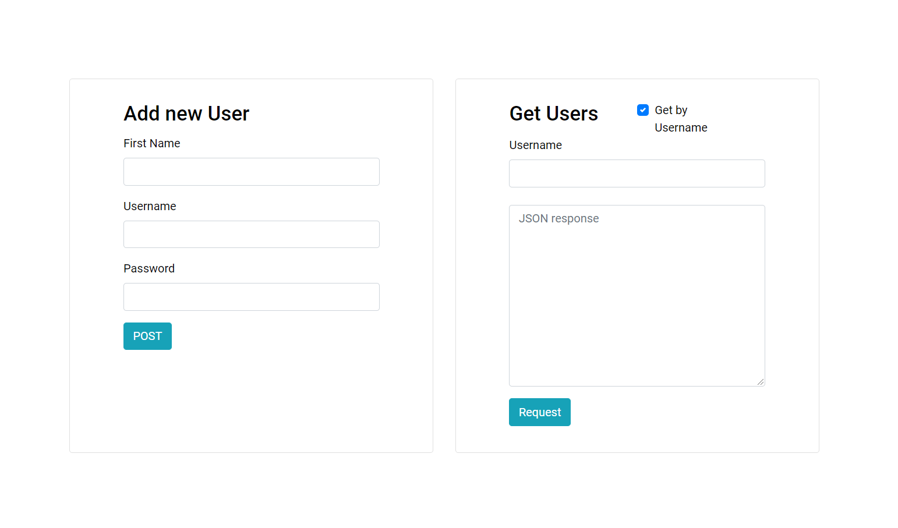

[](https://opensource.org/licenses/MIT)

# Rust Rocket Angular Seed

Use rocket framework to develop the web application backend/services and frontend using Angular CLI, all in a totally integrated workflow and single unified console. This approach will deliver perfect development experience without CORS hassle. 
For more understanding, read [rest-api-in-rust-step-by-step-guide](https://medium.com/better-programming/rest-api-in-rust-step-by-step-guide-b8a6c5fcbff0).

## Built With

* [Rust: 1.43.0](https://www.rust-lang.org/learn/get-started)
* [Rocket:  0.4.4](https://rocket.rs/v0.4/guide/)
* [Angular: 8.0.3](https://angular.io/)

## Getting Started


### Prerequisites

* [Rust](https://www.rust-lang.org/learn/get-started) ( Nightly version)
* [Node.js](https://nodejs.org/) (version 10 or higher)


### Installing

Install rust nightly to your environment 

```
rustup default nightly
```

then install diesel for migrations
```
cargo install diesel_cli — no-default-features — features postgre
```

change your credentials in .env file

Then run below command for setup your DB and tables
```
diesel setup
diesel migration generate users
```

next you need to navigate into ui folder.Then run 

```
cd ui
npm install
```

End with an example of getting some data out of the system or using it for a little demo


## Deployment
Run command below in root directory to start the application

````
cargo run
````

## Authors

* **Asel Siriwardena** - [GITHUB](https://github.com/AselSiriwardena)

See also the list of [contributors](https://github.com/AselSiriwardena/rust-rocket-angular-seed/graphs/contributors) who participated in this project.

## License

This project is licensed under the MIT License - see the [LICENSE.md](LICENSE.md) file for details


